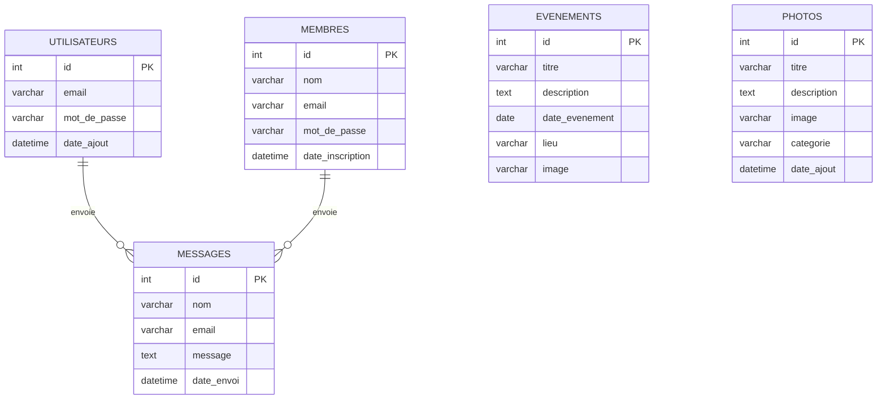

<div align="center">

# 🌟 Aujourd'hui vers Demain

### Plateforme Web de Gestion Associative

[](https://php.net)
[](https://mysql.com)
[](https://getbootstrap.com)
[](LICENSE)

*Application web complète développée pour l'association "Aujourd'hui vers Demain" de Noisy-le-Sec*

[📖 Documentation](#-fonctionnalités) • [🚀 Installation](#-installation-rapide) • [📸 Captures](#-captures-décran) • [👥 Équipe](#-équipe)

---


</div>

## 📋 À Propos

> **Projet de stage** réalisé dans le cadre de notre formation en développement web.

L'association **Aujourd'hui vers Demain** accompagne les habitants du quartier dans leur quotidien : aide aux devoirs, événements de quartier, bénévolat... Ce projet vise à **digitaliser** leurs activités grâce à une plateforme moderne et intuitive.

### 🎯 Objectifs du Projet

| Objectif | Description |
|----------|-------------|
| 🗄️ **Base de données** | Conception et modélisation d'une BDD relationnelle complète |
| 💻 **Développement Full-Stack** | Interface utilisateur moderne + logique serveur robuste |
| 🔐 **Back-Office sécurisé** | Espace d'administration pour l'association |
| 📱 **Responsive Design** | Compatible mobile, tablette et desktop |

---

## ✨ Fonctionnalités

### 🌐 Site Public (Front-Office)

<table>
<tr>
<td width="50%">

**🏠 Page d'Accueil**
- Design moderne "One Page"
- Animations fluides (AOS Library)
- Mode Sombre / Clair
- Section héro dynamique

</td>
<td width="50%">

**📅 Gestion des Événements**
- Affichage des événements à venir
- Moteur de recherche intégré
- Cartes avec images et détails
- Animations au survol

</td>
</tr>
<tr>
<td>

**📝 Inscriptions**
- Formulaire Aide aux Devoirs
- Formulaire Bénévolat avec CV
- Pré-remplissage automatique
- Validation des données

</td>
<td>

**🖼️ Galerie Photos**
- Affichage dynamique par catégories
- Filtres et tri par date
- Effet Lightbox au clic
- Photos événements + galerie

</td>
</tr>
</table>

### 🔧 Espace Administrateur (Back-Office)

| Fonctionnalité | Description |
|----------------|-------------|
| 🔐 **Connexion sécurisée** | Authentification avec hachage bcrypt |
| 📊 **Dashboard** | Vue d'ensemble des événements |
| ➕ **CRUD Événements** | Créer, modifier, supprimer avec upload d'images |
| 🖼️ **Gestion Galerie** | Ajouter/supprimer des photos par catégorie |
| 📬 **Messagerie** | Centralisation des demandes (contact, inscriptions, bénévolat) |
| 🛡️ **Sécurité** | Logs de connexion et gestion des sessions |

### 🛡️ Sécurité Implémentée

- ✅ Protection CSRF sur les formulaires
- ✅ Hachage des mots de passe (`password_hash`)
- ✅ Requêtes préparées (PDO) contre les injections SQL
- ✅ Validation et échappement des données
- ✅ Protection des uploads (types de fichiers autorisés)
- ✅ Sessions sécurisées avec timeout

---

## 🛠️ Stack Technique

<div align="center">

| Catégorie | Technologies |
|-----------|--------------|
| **Back-End** |  |
| **Base de Données** |  |
| **Front-End** |    |
| **Framework CSS** |  |
| **Icônes** |  |
| **Animations** |  |
| **Outils** |    |

</div>

---

## 🚀 Installation Rapide

### Prérequis

- PHP 8.0 ou supérieur
- MySQL 5.7 ou supérieur
- Serveur local (Laragon, WAMP, XAMPP...)

### Étapes d'installation

```bash
# 1. Cloner le dépôt
git clone https://github.com/tanaa75/Aujourdhui-vers-demain-stage.git

# 2. Accéder au dossier
cd Aujourdhui-vers-demain-stage
```

### Configuration de la base de données

1. **Créer la base de données** dans phpMyAdmin :
   ```sql
   CREATE DATABASE asso_db CHARACTER SET utf8mb4 COLLATE utf8mb4_unicode_ci;
   ```

2. **Importer les tables** : Exécutez le script SQL fourni ou créez les tables manuellement

3. **Configurer la connexion** dans `db.php` :
   ```php
   $host = 'localhost';
   $dbname = 'asso_db';
   $username = 'root';
   $password = '';
   ```

### Accès à l'application

| Page | URL | Identifiants |
|------|-----|--------------|
| 🏠 Site public | `http://localhost/aujourdhui-vers-demain/` | - |
| 🔐 Connexion Admin | `http://localhost/aujourdhui-vers-demain/login.php` | `admin` / `admin123` |
| 📊 Dashboard | `http://localhost/aujourdhui-vers-demain/admin_dashboard.php` | Connexion requise |

---

## 📁 Structure du Projet

```
aujourdhui-vers-demain/
├── 📄 index.php              # Page d'accueil principale
├── 📄 db.php                 # Configuration base de données
├── 📄 navbar.php             # Barre de navigation
├── 📄 footer.php             # Pied de page
│
├── 🌐 Pages Publiques
│   ├── galerie.php           # Galerie photos dynamique
│   ├── actions.php           # Nos actions (aide aux devoirs)
│   ├── benevolat.php         # Devenir bénévole
│   └── contact.php           # Formulaire de contact
│
├── 🔐 Authentification
│   ├── login.php             # Connexion admin
│   ├── inscription.php       # Inscription membre
│   ├── connexion.php         # Connexion membre
│   └── logout.php            # Déconnexion
│
├── 🔧 Administration
│   ├── admin_dashboard.php   # Gestion événements
│   ├── admin_galerie.php     # Gestion galerie photos
│   ├── admin_add_photo.php   # Ajout de photos
│   ├── admin_messages.php    # Messagerie centralisée
│   └── admin_security.php    # Logs de sécurité
│
├── 🎨 Assets
│   ├── mobile-responsive.css # Styles responsive
│   ├── script_theme.js       # Gestion thème jour/nuit
│   └── uploads/              # Images uploadées
│
└── 📋 Documentation
    ├── README.md             # Ce fichier
    └── .htaccess             # Configuration Apache
```

---

## 📸 Captures d'écran

<div align="center">

| Page d'Accueil | Galerie Photos |
|----------------|----------------|
|  | *Ajoutez une capture* |

| Admin Dashboard | Mode Sombre |
|-----------------|-------------|
| *Ajoutez une capture* | *Ajoutez une capture* |

</div>

---

## 🗄️ Schéma de la Base de Données



---

## 👥 Équipe

<div align="center">

| Développeur | Rôle |
|-------------|------|
| **CA TANAVONG** | Développeur Full-Stack |
| **BEDJOU AYOUB** | Développeur Full-Stack |

</div>

---

## 📄 Licence

Ce projet a été réalisé dans le cadre d'un **stage de formation**.  
Tous droits réservés © 2026 - CA TANAVONG & BEDJOU AYOUB

---

<div align="center">

**⭐ Si ce projet vous a plu, n'hésitez pas à lui donner une étoile !**

[](https://github.com/tanaa75)

</div>
